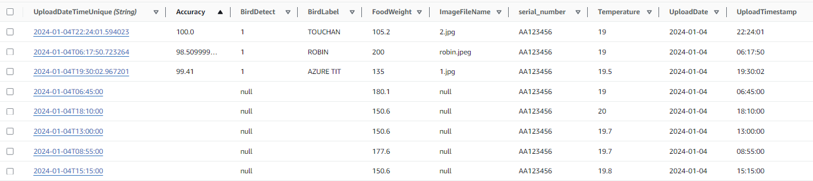

# twitter feed
The following paragraphs introduce the whole software side of our pipeline

## Raspberry Pi

### Sensors:

**Camera**
* A baseline for uploading random jpg image to S3 bucket (image storage AWS database) is estalished
* A dynamodb database for storing time of upload(time of detection of birds) and file name is established
* A proper way of extracting the dynamodb information to node.js is created, with a proper image url and timestamp
* A rough display is made in react to display the images according to timestamp order

>A rough pipeline made - 01/21/24 (tired)

**Weight Sensor** `weightSensor.py`   
* Two weight sensors: food weight and bird detection
* Create bus pipeline with two sensors and process weight data

**Temperature Sensor** `tempSensor.py` 

### Data Upload
There are two data upload file, actual and fake:

**Actual Data Upload** `new_actual_upload.py`
The Actual Data Upload Pipeline is in a single super loop, with `time` function handling faster and slower procedure. The bird detection sensor is constantly checking if a bird visists while the food weight and temperature sensor send the data every 5 seconds to the server for monitoring the change in data.

We did try to separate the faster and slower features into two separate threads. However, it seems like the the two weight data sensors are communicating to the same I2C ADC chips, so the data cannot be send in parallel.

**Fake Data Upload** `new_fake_upload.py`
The Fake Data Upload Pipeline runs in two separate threads. The main thread handles bird detection in real time with weight and temperature data and another thread handles weight and temperature upload every 5 minutes.

The following random generators produce some kind of "fake real" weight and temperature data:
```python
weight_food = round(random.choices([Decimal(current_weight), 
                    Decimal(max(50.0, random.uniform(current_weight-20, current_weight)))],
                    weights=[0.05, 0.95])[0], 1)
            
        

temperature = round(random.choices([Decimal(current_temperature), 
                    Decimal(min(10.5, max(7.1, random.uniform(current_temperature-0.5, current_temperature+0.5))))],
                    weights=[0.6, 0.4])[0], 1)
```


## Bird Recognition Server:
server code: run `inference_server_code_queue.py` on ec2 instance with `bird_model_copy.py` a must dependency.

client code: `new_fake_upload.py` or `new_actual_upload.py` call the server code to make predictions

Bird detection based on inference on Resnet model created by: https://github.com/Moddy2024/Bird-Classification/tree/main

We tried to run prediction locally on raspberry pi after detecting a bird and send the whole package to the database. However, the ML network is so large that the inference time for a single picture on raspberry pi takes more than 15 minutes. Thus, we used a separate server for bird detection which takes around 40 seconds to make a single prediction.

The server code structured to process the data in a queue and asynchronously running on the server so that it doesn't cause the upload procedure to wait until prediction finishes.

Good performance on Internet images, becuase the network is trained on those images, with over 95% of accuracy. **Poor performance on actual images taken from the bird feeder. Could retrained a network based on the actual images to improve performance.**

>Bird prediction pipeline roughly finished - 01/29/24 

## Main Server 
The main server handles requests from client App and filter the Database Table and send back the requested data to client App. For all features, please check the description in file `new_testing_sensor_table.js`.

## React App Frontend
We use React for constructing our WebApp and AWS Amplify for handling user authentication procedure. For all features, please check the description in files in folder `Scalable_Main_FullStack\amplifyapp\Frontend`.

## Database
1. Twitter_Table_New: stores all data




2. Twitter_User_Table: bind user_id and bird_feeder's serial number

#

